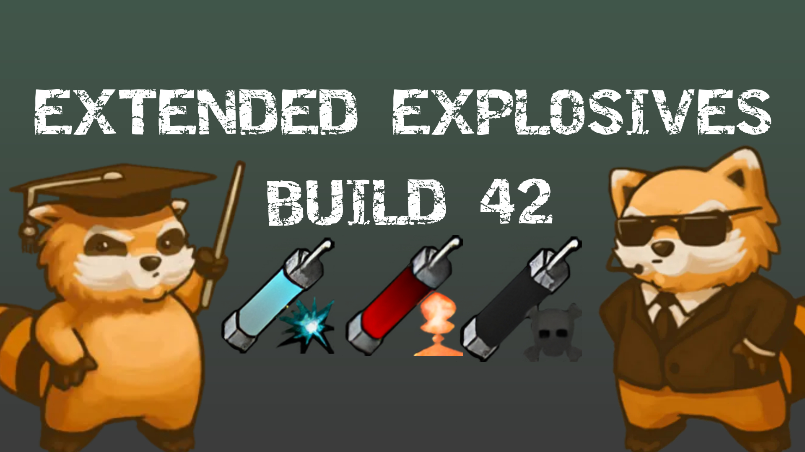

# 💣 Extended Explosives

> Adds 3 new powerful throwable explosives to Project Zomboid.  
> For when a pipe bomb just isn't enough.

---

## 🧨 Items

| Item | Description |
|------|-------------|
| 🔥 **Inferno Bomb** | Incendiary bomb. Burns everything in its radius. |
| 💥 **Shockwave Bomb** | Pure blast power. No fire, maximum effective range. |
| ☠️ **Armageddon Bomb** | The heaviest hitter. High damage, decent radius, sets average fire. |

---

## ✅ Compatibility

- Build 42.16.x
- Singleplayer

---

## 📦 Installation

1. Subscribe on [Steam Workshop](https://steamcommunity.com/sharedfiles/filedetails/?id=3698541938&snr=___)
2. Launch Project Zomboid
3. Enable the mod in **Mods** menu

---

## 📜 Crafting

Requires **Electricity** skill to craft all items.

---

## ⭐ Support

If you enjoy the mod, leave a rating on the Workshop — it helps a lot!
